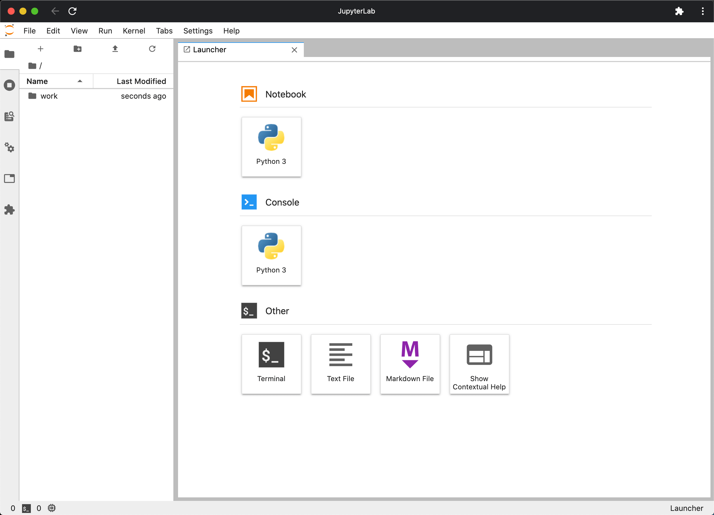
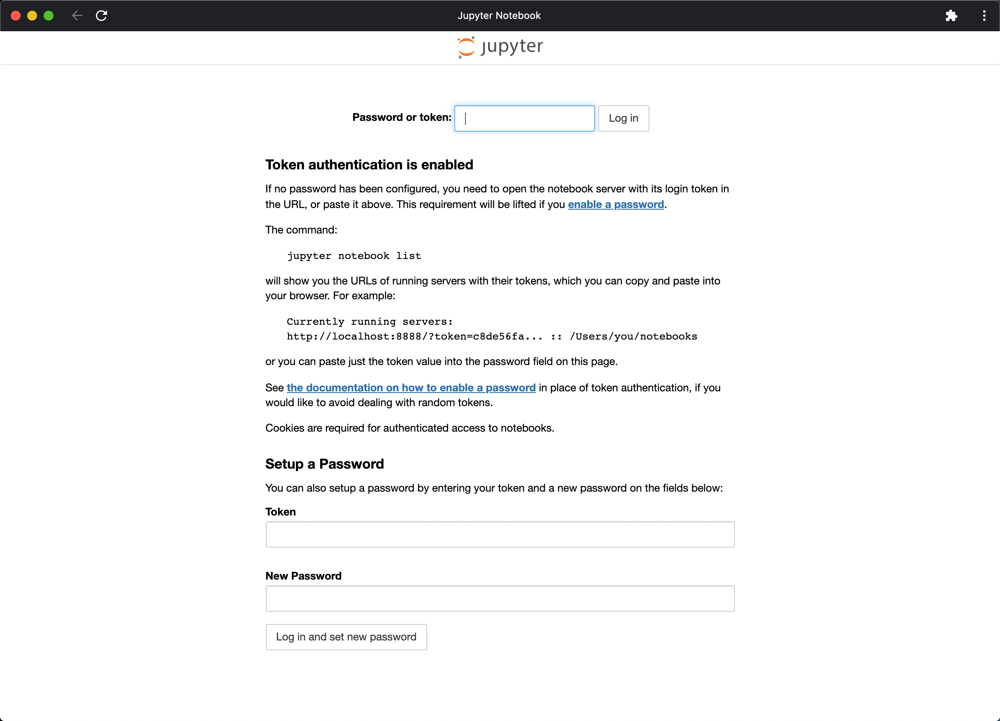

# [JupyterLab](https://jupyterlab.readthedocs.io/)

<!--
brew upgrade pyenv
pyenv install -l | grep conda
-->

## Installation

### conda

```zsh
conda install -c conda-forge jupyterlab
```

```zsh
jupyter --version
```

#### Start

```zsh
jupyter lab
```



### Docker

```zsh
docker pull jupyter/scipy-notebook:latest

docker run -d --restart=always \
--name jupyter \
-p 8888:8888 \
-e JUPYTER_ENABLE_LAB=yes \
-v "$HOME":/home/jovyan/work \
jupyter/scipy-notebook:latest
```

<!--
docker update --restart=no jupyter

docker exec -it jupyter jupyter --version
-->

Visit `http://localhost:8888/lab`.



#### Token

```zsh
❯ docker logs jupyter
Executing the command: jupyter lab
[I 22:32:45.229 LabApp] Writing notebook server cookie secret to /home/jovyan/.local/share/jupyter/runtime/notebook_cookie_secret
[I 22:32:46.051 LabApp] JupyterLab extension loaded from /opt/conda/lib/python3.8/site-packages/jupyterlab
[I 22:32:46.051 LabApp] JupyterLab application directory is /opt/conda/share/jupyter/lab
[I 22:32:46.054 LabApp] Serving notebooks from local directory: /home/jovyan
[I 22:32:46.054 LabApp] Jupyter Notebook 6.1.4 is running at:
[I 22:32:46.054 LabApp] http://e1839b94c616:8888/?token=fc8d547d3d9cb47ae8d855fbb3f788e0c045e0061012a917
[I 22:32:46.054 LabApp]  or http://127.0.0.1:8888/?token=fc8d547d3d9cb47ae8d855fbb3f788e0c045e0061012a917
[I 22:32:46.054 LabApp] Use Control-C to stop this server and shut down all kernels (twice to skip confirmation).
[C 22:32:46.059 LabApp]

    To access the notebook, open this file in a browser:
        file:///home/jovyan/.local/share/jupyter/runtime/nbserver-6-open.html
    Or copy and paste one of these URLs:
        http://e1839b94c616:8888/?token=fc8d547d3d9cb47ae8d855fbb3f788e0c045e0061012a917
     or http://127.0.0.1:8888/?token=fc8d547d3d9cb47ae8d855fbb3f788e0c045e0061012a917
```

Login using `token` `fc8d547d3d9cb47ae8d855fbb3f788e0c045e0061012a917`.
